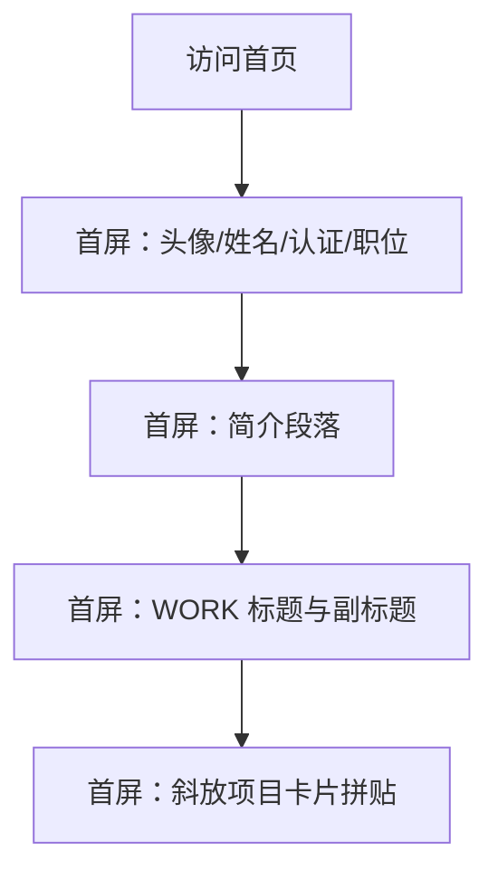

## 1. Product Overview
个人简历/作品集网站的首页首屏改版需求说明。
目标是在桌面端首屏快速建立「身份可信度 + 工作方向 + 代表作品」的第一印象。

## 2. Core Features

### 2.1 Feature Module
本次需求仅涉及以下必要页面：
1. **首页（首屏）**：左上身份信息（头像/姓名/认证/职位）、简介段落、WORK 标题与副标题、下方斜放项目卡片拼贴。

### 2.3 Page Details
| Page Name | Module Name | Feature description |
|-----------|-------------|---------------------|
| 首页（首屏） | 身份信息区（左上） | 展示头像（占位图）、姓名、认证标识、职位；整体位于首屏左上视觉锚点，确保一眼可识别。 |
| 首页（首屏） | 简介段落 | 展示 1–2 段简介文案，强调擅长方向/价值主张；与身份信息形成连续阅读流。 |
| 首页（首屏） | WORK 标题区 | 展示“WORK”主标题与一行副标题（例如：精选项目/近期作品）；作为下方项目拼贴的语义入口。 |
| 首页（首屏） | 项目卡片拼贴（斜放） | 在首屏下半区域展示 3–6 张项目卡片，以“斜放/错位/叠放”形式形成拼贴；卡片使用占位图封面与项目名称（可选）；支持悬停高亮（仅视觉反馈）。 |

## 3. Core Process
用户进入首页后：
- 首先在左上看到头像+姓名+认证+职位，建立身份与可信度。
- 向下/向右自然阅读到简介段落，理解你能做什么。
- 看到 WORK 标题与副标题，理解下方内容是代表作品。
- 视觉焦点落到下方斜放项目卡片拼贴，快速扫视你的项目覆盖面。

