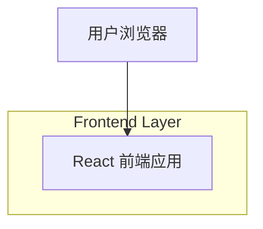

## 1.Architecture design

## 2.Technology Description
- Frontend: React@18 + tailwindcss@3 + vite
- Backend: None

## 3.Route definitions
| Route | Purpose |
|-------|---------|
| / | 首页首屏展示（头像/姓名/认证/职位、简介、WORK 标题与副标题、项目卡片拼贴） |

## 4.API definitions (If it includes backend services)
N/A（无后端服务）

## 5.Server architecture diagram (If it includes backend services)
N/A

## 6.Data model(if applicable)
N/A（本需求不涉及数据存储/数据库）